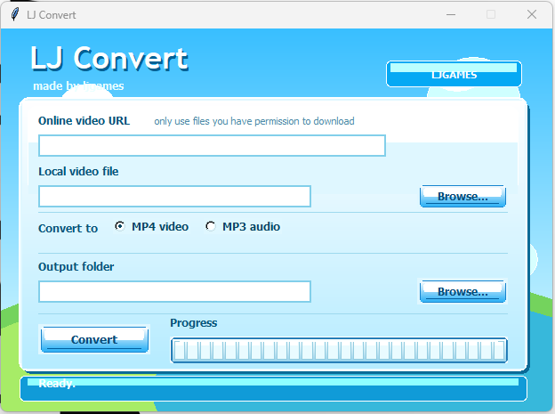

# LJ Convert

**LJ Convert** is a Windows video and audio converter with a glossy Frutiger Aero-inspired interface. It can convert local video files to **MP4** or **MP3**, and it can also download and convert online videos when you have permission to use them.

Made by **LJGAMES**.

## Features

* Convert local video files to MP4
* Convert local video files to MP3
* Download permitted online videos using yt-dlp
* Frutiger Aero-inspired interface
* Glossy blue segmented progress bar
* Custom app icon support
* Can be built as a single Windows EXE
* No command prompt window when built with PyInstaller

## Preview

Add a screenshot named `screenshot.png` to the project folder, then this image will show on GitHub:

```md

```

## Project Files

A simple project setup should look like this:

```txt
LJConvertProject/
├─ README.md
├─ main.py
├─ app.ico
├─ screenshot.png
└─ bin/
   ├─ ffmpeg.exe
   ├─ ffprobe.exe
   └─ yt-dlp.exe
```

## Requirements

To run the Python version, you need:

* Python 3.10 or newer
* FFmpeg
* FFprobe
* yt-dlp

For the easiest setup, put `ffmpeg.exe`, `ffprobe.exe`, and `yt-dlp.exe` inside the `bin` folder next to `main.py`.

## How to Run

Open a command prompt in the project folder and run:

```bat
py main.py
```

## How to Build the EXE

Install PyInstaller:

```bat
py -m pip install pyinstaller
```

Then build the app as a single Windows EXE:

```bat
py -m PyInstaller ^
  --onefile ^
  --windowed ^
  --clean ^
  --name "LJ Convert" ^
  --icon "app.ico" ^
  --add-binary "bin\ffmpeg.exe;bin" ^
  --add-binary "bin\ffprobe.exe;bin" ^
  --add-binary "bin\yt-dlp.exe;bin" ^
  main.py
```

The finished EXE will be created here:

```txt
dist/LJ Convert.exe
```

## Smaller EXE Build

If you want a smaller EXE, you can build without bundling FFmpeg, FFprobe, and yt-dlp:

```bat
py -m PyInstaller ^
  --onefile ^
  --windowed ^
  --clean ^
  --name "LJ Convert" ^
  --icon "app.ico" ^
  main.py
```

This makes the EXE smaller, but FFmpeg, FFprobe, and yt-dlp must be installed separately or available through your system PATH.

## File Size Note

If FFmpeg, FFprobe, and yt-dlp are bundled into the EXE, the final file may be large. This is normal because FFmpeg is a large tool by itself.

## Supported Input Files

LJ Convert supports common video formats, including:

* MP4
* MOV
* MKV
* AVI
* WEBM
* FLV
* WMV
* M4V

## Output Formats

LJ Convert currently supports:

* `.mp4` video output
* `.mp3` audio output

## Screenshot Setup

To add a screenshot to the GitHub README:

1. Open LJ Convert.
2. Press `Windows + Shift + S`.
3. Select the app window.
4. Paste the screenshot into Paint or another image editor.
5. Save it as `screenshot.png`.
6. Put `screenshot.png` in the same folder as `README.md`.

Then the preview image will show automatically on GitHub.

## Legal Notice

Only use LJ Convert with videos and audio that you own, created yourself, have permission to use, or are allowed to download and convert. The developer is not responsible for misuse of this tool.

## Credits

LJ Convert uses:

* [FFmpeg](https://ffmpeg.org/)
* [yt-dlp](https://github.com/yt-dlp/yt-dlp)
* Python Tkinter

